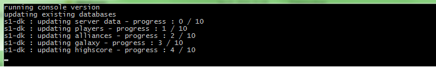

# OGameAPIDatabase
Java tool to save OGame player API to database and create statistics.

**Usage:**

java -jar OGameAPIDatabaseDarkSky.jar

Requires file servernames.txt in the working directory

**Pictures**

